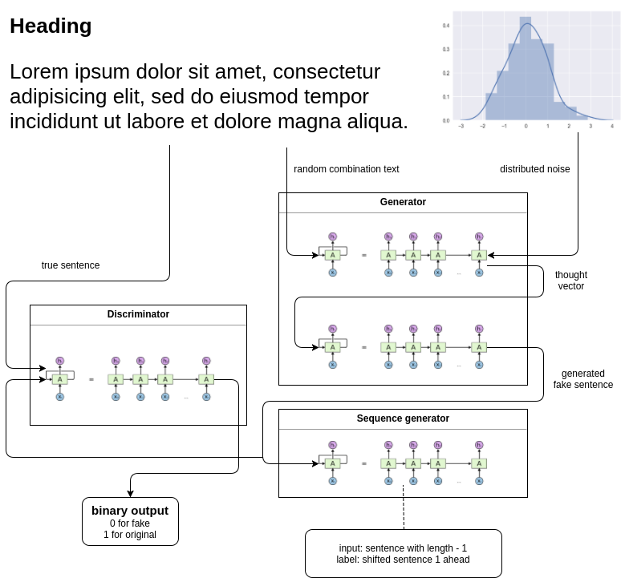
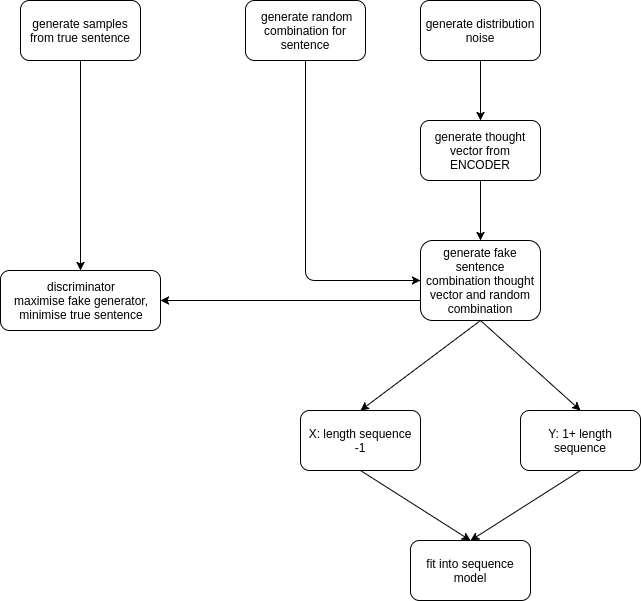

# GAN-Sentence
Generate a new book/essay using GAN-Recurrent-LSTM on Tensorflow



You can edit the diagram by upload [this html](gan-sentence.html) to draw.io.

Basic flowchart,


These are what you can do to improve adversarial training for both discriminator and generator:
1. you may apply generator training for twice or more.
2. tuned momentum constant in ADAM.
3. change Adaptive RMS into pure RMS
4. Recheck my work for generator sentence

I included the [essay](https://github.com/huseinzol05/GAN-Sentence/blob/master/essay) also, but you can replaced with any essay here,
```python
# in main.py
data, vocab = parse.get_vocab('essay')
```

requirement,
```bash
pip install tensorflow numpy scipy
```

## This code is Python 2 and using 'xrange', if you are using Python 3, import xrange from util library
## The generator is word-based generator.

#### Check hyperparameters first before train
```python
# hyperparameters, you can tune here
# in main.py
learning_rate = 0.0001
length_sentence = 64
batch_size = 20
epoch = 100
nested_epoch = 15
num_layers = 2
size_layer = 512
len_noise = 100
tag_length = 5
possible_batch_id = range(len(data) - batch_size)
```

#### Then,
```bash
python main.py
```

